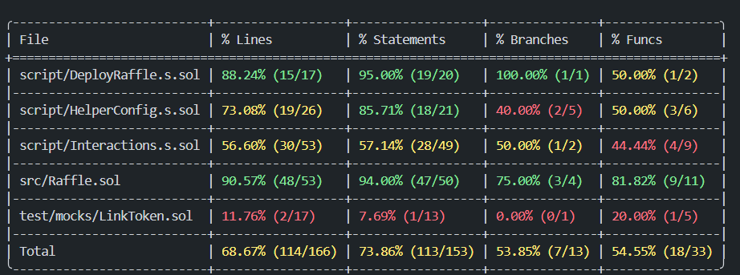

## Foundry

**Foundry is a blazing fast, portable and modular toolkit for Ethereum application development written in Rust.**

Foundry consists of:

-   **Forge**: Ethereum testing framework (like Truffle, Hardhat and DappTools).
-   **Cast**: Swiss army knife for interacting with EVM smart contracts, sending transactions and getting chain data.
-   **Anvil**: Local Ethereum node, akin to Ganache, Hardhat Network.
-   **Chisel**: Fast, utilitarian, and verbose solidity 

#WHAT IS THIS PROJECT ABOUT?
Well, This is a smart contract lottery project.Which generates some random numbers , pick a winner from the participants.

#WHY THIS PROJECT IS REAL LIFE BASED?
In real life, the result of the lottery can be mannipulated, where as in this prject it is been taken care of by using "CHAINLINK VRF "-> It is a random number generator. 

#WHAT IS SPEACIAL ABOUT THIS PROJECT?
In case of generating a random number and a subscription, I need to interact with CHAINLINK NODES, 
It can be done by Two Ways
1.Through Chainlink UI (You can search Chainlink VRF ->Then go through the docs)
2.Programmatically (I learned from Cyfrin Updraft)

As a programmer(Beginner) ,i did this Programmatically.

#ADDITIONAL FEATURES
 This project is "nearly" ready to be deployed on both ANVIL (Local Chain) and Sepolia Network, and I will add MANNIET Network .

#Conclusion
I learned many many new things from this prjects :-
1. EVENT, 
2. ENUMS, 
3. INTERACTING WITH VRF CONTRACT ,
4. MAKING A MULTINETWORK READY CONTRACT BY ADDING -> HELPERCONFIG AND INTERACTION ,
5. I COME TO KNOW ABOUT Vm not vm and its use.
6. vm.roll and vm.wrap
7. A little about Abstruct contract
8. A quick check about Gas by  "forge snapshot"
9. vm.expectEmit()
10. vm.recordLogs();-> i really don't understand it very well
....And many more

I WILL UPGRAD THE INTERACTION.T.SOL FOR MORE COVERAGE AND I WILL TRY TO MAKE THIS READ ME FILE MORE ATTRACTIVE AS A GOOD PRACTICE

Here is the Coverage details:-

well, This is all for now. Hope that i will learn more about web3 and can be a Security Researcher.